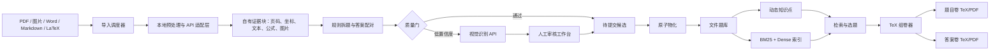

# 竞赛项目计划案

版本：2026-07-27

本方案定义比赛版本的目标、边界、架构、评测与实施节奏。三套参考项目的逐项审查、验证结果和采用决策见 [13-reference-project-review.md](13-reference-project-review.md)；当前可运行基线见 [12-first-delivery-test.md](12-first-delivery-test.md)。

## 一、项目概述

### 1. 项目名称

暂定名称：**PhysBank：证据可追溯的物理题库构建与智能组卷系统**

### 2. 一句话定位

把 PDF、扫描试卷、讲义、Markdown、LaTeX 等已有物理资料，批量转换为可审核、可检索、可复用的题目文件，再从真实题库中组装并输出可编辑的 TeX 试卷及独立题目卷、答案卷 PDF。

### 3. 核心判断

本项目解决的不是“让大模型临时生成几道题”，而是更基础、更真实的问题：

- 教师和教研人员已有大量资料，但题目被锁在整份文档里。
- 普通 OCR 在题号、公式、题图、跨页题和答案对应上不可靠。
- 固定题型 schema 无法覆盖不同学段、竞赛题、大学物理题和实验题。
- 纯 Agent 逐页转录虽然质量较高，但速度、Token 成本和可重复性不足。
- 普通题库导出经常只是拼接来源 PDF，结果不可编辑，也难以重新排版。

项目因此采用“批量程序处理普通内容，视觉模型处理疑难区域，人工只审核异常项”的路线，并坚持题目正文与答案正文作为生产真源。

## 二、参考系统研究结论

本计划参考了三套实现，但不直接复制其中任一系统。统一结论是：保留分阶段处理、页面证据、稳定 ID、轻量题目记录和可编辑导出的思路；拒绝硬编码路径、随机物化、非原子写入、整页图片入题、预设知识树和伪语义向量。

详细依据见 [13-reference-project-review.md](13-reference-project-review.md)。

### 2026-07-27 实施进度

本轮已把安全原子物化、阻断式候选审核、动态知识点、SQLite FTS5 与本地向量融合、可选 embedding API、导出 manifest 和题目级 TeX 错误定位接入主链路。13 项自动化回归测试、前端生产构建和浏览器端到端冒烟均通过。

计划中尚未实现的关键能力是页级证据块与缓存、选择性视觉 API、题目答案自动配对、局部题图自动裁剪、候选拆分合并、脱敏真值集和万题级评测。比赛陈述与演示不得把这些目标能力表述为当前已完成能力。

### 参考取舍矩阵

| 能力 | 采用方案 | 明确拒绝 |
| --- | --- | --- |
| 题目表示 | 题目正文 + 答案正文 + 局部资产 + 松散元数据 | 固定选择题、选项、解析步骤 schema |
| OCR 内容来源 | 自有证据块 + 页码与坐标 + 局部视觉 API 修正 | Text-only LLM 修补缺失字符 |
| LLM 作用 | 判断边界、修正疑难区域、建议标签、解释召回 | 默认逐页全文重写、编造答案 |
| 题目 ID | 来源哈希 + 逻辑题号生成稳定 ID | 随机 ID 导致重复入库 |
| 审核 | 候选区审核通过后原子提交 | `human_review_needed` 仍自动入库 |
| 题图 | 从来源页裁剪出的独立区域 | 整页截图、缺图占位链接 |
| 知识点 | 从题目生成候选并由人确认、合并 | 固定高中知识树作为生产真源 |
| 检索 | 真实 dense embedding + BM25 混合召回 | 哈希桶向量冒充语义检索 |
| 组卷 | 正文拼入模板，题目与答案分别导出 | 合并来源 PDF、题目答案混在一卷 |
| 写入 | 完整预检、临时目录、原子重命名、冲突停止 | 边复制边写正式题库、失败留半成品 |

## 三、竞赛定位与项目边界

### 1. 目标用户

- 个人教师、竞赛教练和教研人员。
- 需要整理大量个人物理资料的学生或研究者。
- 维护内部题库并反复组卷的小型教学团队。

知识范围完全由用户导入的资料决定，不限定高中，也不预设教材或竞赛体系。

### 2. 比赛版本必须完成

- 浏览器上传文件或投放文件夹，后台批量处理。
- 支持题目卷、答案卷分离或合一的常见资料。
- 结构化资料走自研快速通道；扫描资料走自研页级调度与选择性视觉 API 通道。
- 显示导入进度、异常原因、模型调用量和待审核项。
- 审核界面支持编辑、拆分、合并、裁剪题图、批准和驳回。
- 正式题库只保存题目正文、答案正文、局部资产和松散元数据。
- 知识点从已导入内容产生，可确认、改名、合并和作为检索条件。
- 使用真实关键词与向量混合检索。
- 手动选题或按自然语言需求从题库召回候选题。
- 分别生成 `questions.tex/pdf` 和 `answers.tex/pdf`。
- 全流程保留来源、页码、内容哈希和处理日志，可复现、可追溯。

### 3. 比赛版本明确不做

- 公网多租户、计费和复杂权限系统。
- 完全无人审核的扫描题库导入。
- 让 LLM 生成题库外题目并冒充已有题目。
- 固定题型枚举驱动的题目数据库。
- 把复杂知识图谱、学习诊断和推荐算法作为前置依赖。
- 将 MinerU、PaddleOCR、Mathpix、Qdrant 等完整外部系统作为运行时核心依赖。
- 与主流程无关的重视觉包装。

比赛主链路由本项目实现。允许使用 PDF 渲染、图片处理、Web 框架等基础库，也允许调用可替换的视觉识别 API 和 embedding API；但批次调度、页级路由、题目拆分、答案配对、题图裁剪、质量门、审核、入库、索引融合和组卷逻辑必须由项目自身完成。

## 四、产品闭环

```text
原始资料
  -> 批次登记与来源指纹
  -> 本地预处理与页级 API 调度
  -> 题目边界与答案匹配
  -> 题图区域裁剪
  -> 自动质量门
  -> 人工审核异常项
  -> 原子提交文件题库
  -> 动态知识点与混合索引
  -> 搜索、选题、替换
  -> 题目卷与答案卷 TeX/PDF
```

用户的完整操作路径：

1. 把一套或多套资料拖入浏览器，或放入 `imports/inbox/`。
2. 系统自动判断原生文本 PDF、扫描 PDF、Markdown、LaTeX、Word 或 JSON。
3. 普通页面批量处理，疑难页和疑难区域自动进入视觉识别队列。
4. 用户只查看被标记的问题：漏题号、跨页、公式异常、缺图、答案不匹配等。
5. 批准后，系统一次性提交题目文件并更新知识点候选和索引。
6. 用户输入知识点、关键词或自然语言要求，选择和替换候选题。
7. 系统生成独立题目卷、答案卷和可编辑源文件。

## 五、系统架构



### 1. 四层数据边界

#### 来源与证据层

保存原始文件、文件哈希、页面渲染、解析块、坐标、OCR/模型版本和日志。来源 PDF 放在独立 source store，不放进题目的 `assets/`。

#### 候选与审核层

保存待拆分题目、答案匹配、警告、置信度和审核状态。该层可以使用结构化 JSON 或 SQLite，但不是正式题库真源。

#### 正式题库层

每道题保持简单结构：

```text
questions/{question_id}/
  question.md | question.tex | question.txt
  answer.md   | answer.tex   | answer.txt
  metadata.yaml
  assets/*
```

选项、小问、实验步骤和解析直接写在正文或答案中，不拆成硬编码字段。

#### 派生索引层

保存关键词、向量、知识点关系和统计摘要。该层随时可以从正式题库重建，不能成为唯一真源。

### 2. 竞赛部署依赖原则

竞赛运行配置只保留：

- Next.js 前端与 FastAPI 后端。
- 文件题库与本地 SQLite/索引文件。
- PDF 渲染、图片裁剪、TeX 编译等底层库。
- 可配置的视觉识别 API 和 embedding API。

PostgreSQL、Redis、Qdrant、完整 OCR 平台和 Codex Agent 均不进入比赛必需运行链路。现有仓库中的数据库兼容层可以暂时保留代码，但比赛 Docker 配置和演示流程不依赖它们。API 调用通过项目自己的 provider interface、队列、缓存、重试和审计模块完成。

## 六、批量导入方案

### 1. 自研主链路与 API 边界

比赛运行时不接入完整第三方 OCR 流水线。项目自己完成文件拆页、文本层判断、页面渲染、任务排队、区域裁剪、结果缓存、题目边界、答案匹配和质量验证，只把“从页面或局部图片识别文字、公式与版面”作为外部视觉 API 能力。

视觉 API 使用统一的小接口，便于更换供应商：

```text
analyze_page(page_image, text_hint?)
  -> visible_question_numbers
  -> candidate_regions[]
  -> figure_regions[]
  -> warnings[]

transcribe_region(region_image, context?)
  -> markdown_latex
  -> confidence
  -> uncertain_spans[]
```

项目将 API 返回统一转换成自己的证据格式：

```text
block_id + page + normalized_bbox + type + markdown_latex + confidence + source_hash
```

Markdown、LaTeX、TXT、JSON 和具有可靠文本层的 PDF 不调用视觉 API，直接进入本地快速通道。扫描页使用 API，但不把供应商返回的整份 Markdown 当成正式题库，而是先生成项目自己的候选记录。

MinerU、PaddleOCR、Mathpix 等只可在开发阶段作为离线对照，帮助判断本项目识别质量是否合理；不能出现在比赛运行依赖、部署要求或核心创新声明中。

### 2. 页面预检与路由

每页先判断：

- 是否存在可靠文本层。
- 文本覆盖率和乱码比例。
- 题号候选是否连续。
- 公式块和图片块数量。
- 页面方向、清晰度和裁切情况。
- 是否可能是跨页题或答案续页。

原生文本页在本地批量处理；扫描页通过有限并发的异步 API 队列识别；只有公式密集、跨页、漏题号或图文归属不明的区域才进入第二次局部识别。所有结果按来源哈希、页码、区域和 prompt 版本缓存，只重跑失败页或修改区域。

### 3. 题目边界识别

优先使用项目内规则识别可见大题号、标题层级和版面间距。规则不确定时，视觉 API 只返回证据块范围：

```json
{
  "question_number": "3",
  "start_block": "p4-b12",
  "end_block": "p5-b8",
  "warnings": ["跨页", "题图归属需检查"]
}
```

API 默认不重写整道题。最终正文由已确认块按阅读顺序组装；只有明确错误的公式或文本区域才允许生成带来源坐标的修正 patch。扫描页候选在比赛版本中默认需要人工抽检，原生文本资料满足全部质量门后才允许自动批准。

### 4. 答案匹配

- 文件夹级 manifest 先声明或推断题目卷、答案卷和合一卷关系。
- 以大题号集合、重复题干、页码顺序和子问覆盖共同匹配。
- 缺答案时允许题目进入候选，但必须明确标记“来源未提供答案”。
- 声称有答案但匹配失败时不能自动批准。
- 不根据常识或模型能力补写答案。

### 5. 题图处理

- 视觉 API 返回归一化图像区域，项目代码映射到页面像素并裁剪局部题图。
- 图片文件名使用来源哈希、页码和区域坐标生成，保证可重复。
- 正文通过 `` 引用。
- 整页扫描图只能留在证据层。
- 缺图、错误页图或未引用图片均阻止自动批准。

### 6. 自动质量门

自动批准前必须同时满足：

- 题目正文非空且大题边界无冲突。
- 来源页覆盖没有无解释空洞。
- 公式定界符和常见 LaTeX 结构可解析。
- 每个图片引用存在，且不是整页渲染图。
- 题目与答案编号无明显错配。
- 稳定 ID 不与不同内容记录冲突。
- `human_review_needed` 为 false，且没有阻断级 warning。

质量门失败只进入审核队列，不写正式题库。

### 7. 安全、幂等与原子提交

正式提交顺序：

1. 预检所有正文、metadata、图片、路径和哈希。
2. 根据 `source_document_hash + paper_key + visible_question_number` 生成稳定 ID。
3. 将完整记录写入同一文件系统下的 `.staging/{job_id}/{question_id}`。
4. 重新读取并验证 staging 内容。
5. 使用原子重命名提交到 `questions/{question_id}`。
6. 已存在且全量哈希相同则跳过；存在但不同则停止并等待人工处理。
7. 批次全部结束后统一重建索引。

任何失败都不能留下部分正式记录，也不能静默覆盖人工修改。

## 七、动态知识点方案

知识点是题库内容的派生目录，不是预设题型结构。

### 1. 生成流程

1. 从批准题目的题干、答案和已有标签提取候选概念。
2. 对名称做标准化，但保留原始表达与来源题目。
3. 检索已有概念，提示“新建、同义词、上位概念、待确认”。
4. 用户可确认、改名、合并、删除或调整父级。
5. 确认结果写入松散 metadata，并更新派生关系索引。

### 2. 约束

- 不随项目预置“高中物理完整知识树”。
- 演示 seed 只能帮助界面展示，不能覆盖用户题库生成的目录。
- 不确定时保留为候选，不能默认塞入“力学”或“综合”。
- 一道题可以属于多个知识点，知识点不决定题目正文结构。

### 3. 比赛版范围

比赛版实现候选、确认、改名、合并、频次统计和按知识点筛选。复杂图谱推理和学习路径推荐放入后续版本。

## 八、RAG 与检索方案

### 1. 当前问题

当前本地索引通过词元哈希到固定桶，只能形成轻量相似度，不能作为竞赛中的“语义检索”证据。比赛版必须使用真实模型并建立标注评测集。

### 2. 推荐实现

- 使用 SQLite FTS5 和项目内 BM25 查询负责题号、公式符号、机构名和专有词等精确召回。
- 通过可替换的 embedding API 获取真实 dense vector，项目本地保存向量与题目映射。
- 由项目实现余弦检索、过滤和 Reciprocal Rank Fusion，不引入外部向量数据库。
- metadata 用于知识点、来源、年份和审核状态过滤。
- 可选 reranker 只处理前几十个候选，不进入基础可用性依赖。

本地派生索引建议采用：

```text
questions/.index/
  lexical.sqlite       # FTS5 / BM25
  vectors.f32          # 连续 float32 向量
  vector-map.json      # question_id、偏移、维度、内容哈希
  index-manifest.json  # embedding provider/model、版本和构建时间
```

向量生成可以使用 API，但索引文件、检索、融合与过滤由项目自身实现。Embedding API 不可用时系统仍保留关键词检索；更换模型后可从题目文件完整重建向量索引。

### 3. LLM 在组卷中的边界

LLM 可以把“找 8 道偏电磁学、包含两道有图题、难度递增的练习”解析为检索条件，也可以解释候选题和建议替换。最终题目 ID 必须来自检索结果，LLM 不能绕过题库生成正式题目。

## 九、组卷与输出方案

### 1. 用户输入

- 试卷标题和可选日期。
- 手动选择的题目。
- 自然语言需求、知识点或关键词。
- 题目数量。
- 来源、年份、是否含图等可选过滤。

### 2. 生成流程

1. 合并手动题目与检索候选。
2. 去重并显示来源、知识点和命中原因。
3. 用户调整顺序或替换题目。
4. 读取题目正文、答案正文和局部资产。
5. 将题目正文拼入题目卷 TeX 模板。
6. 将答案正文拼入答案卷 TeX 模板。
7. 复制被引用资产并重写相对路径。
8. 分别编译 PDF，保留 TeX 与构建日志。

### 3. 输出

必须输出：

```text
questions.tex
questions.pdf
answers.tex
answers.pdf
build-questions.log
build-answers.log
assets/*
manifest.json
```

`manifest.json` 记录题目 ID、顺序、来源哈希、内容哈希和模板版本，保证试卷可复现。

可选输出：

- `questions.docx`
- `answers.docx`

Word 导出来自参考 C，适合作为教师可编辑格式，但优先级低于 TeX/PDF 主链路的稳定性。

## 十、浏览器界面范围

### 1. 导入中心

- 文件/文件夹上传。
- 批次队列、当前阶段、页数、耗时和错误。
- 快速页、视觉页、待审核页的数量统计。
- 重新处理失败页，不重跑整个批次。

### 2. 审核工作台

- 左侧来源页面与高亮区域。
- 中间题目、答案 Markdown/LaTeX 编辑器及实时渲染。
- 右侧 warning、来源页、候选知识点和图片资产。
- 拆分、合并、裁图、批准、驳回。

### 3. 题库

- 列表、搜索、来源和知识点筛选。
- 正文、答案、公式和题图渲染。
- 编辑保存、冲突提示和重新索引。

### 4. 知识点

- 待确认候选。
- 已确认知识点与题目数量。
- 改名、合并、调整父级和筛选题目。
- 点击知识点进入题目列表，不能跳到旧审核页面。

### 5. 组卷工作台

- 搜索条件、题目数量和手动选择。
- 候选预览、命中原因、替换和排序。
- 题目卷/答案卷 TeX、PDF、日志和 manifest 下载。

界面服务于重复操作，不制作营销式落地页，不让旧兼容入口出现在主导航。

## 十一、竞赛创新点

### 1. 证据块驱动的选择性多模态导入

与“整页 OCR 后交给 LLM 重写”不同，系统保留页面坐标和内容块，让模型只判断边界或修正局部疑难区域。普通页面批量处理，复杂页面按需使用视觉模型，兼顾保真、成本和速度。

### 2. Schema-light 题库与自生长知识体系

题目内部不依赖固定题型字段，因此可以容纳不同学段、竞赛、大学物理和实验材料；知识点从实际题库中生长并接受人工治理，而不是先构造一套假定适用的目录。

### 3. 可追溯的 RAG 组卷

自然语言只用于检索和解释，正式试卷中的每道题均来自可定位的题目文件，并保留来源与内容哈希。输出既有可编辑 TeX，也有分离的题目卷和答案卷 PDF。

### 4. 可验证的工程闭环

稳定 ID、审核闸门、原子提交、可重建索引、导出 manifest 和失败样例报告，使系统不仅能演示一次，还能重复处理真实批次。

## 十二、评测方案

### 1. 真值测试集

建立脱敏、可提交的测试集，至少覆盖：

- 原生文本 PDF。
- 普通扫描 PDF。
- 公式密集题。
- 含受力图、电路图、光路图或数据图的题目。
- 跨页大题。
- 题目卷与答案卷分离。
- 题目答案合一。
- Markdown、LaTeX、Word 和结构化 JSON。
- 旋转页、低清页、重复题号、缺答案和坏图片等异常输入。

人工真值包括大题边界、来源页、正文、答案、局部题图和知识点候选。

### 2. 核心指标

| 维度 | 指标 | 比赛目标 |
| --- | --- | --- |
| 拆题 | 大题边界 Precision / Recall / F1 | F1 不低于 95% |
| 内容 | 题号、单位、关键符号抽检正确率 | 自动结果不低于 95%，审核后 100% |
| 公式 | 可编译率、公式人工错误率 | 可编译率不低于 98% |
| 答案 | 大题匹配率、子问覆盖率 | 匹配率不低于 95% |
| 图片 | 题图召回率、错挂率、整页误用率 | 错挂和整页误用为 0 |
| 审核 | 每页人工审核时间、异常页比例 | 相比逐页 Agent 审核时间降低 60% |
| 成本 | 视觉模型处理页占比 | 不高于总页数的 30% |
| 幂等 | 同批次重复运行新增题目数 | 0 |
| 原子性 | 失败任务留下的正式半成品数 | 0 |
| 检索 | Recall@10、nDCG@10 | Recall@10 不低于 90% |
| 性能 | 1 万题规模查询 P95 | 小于 2 秒 |
| 组卷 | 100 题 TeX/PDF 成功率 | 100% |
| 追溯 | 题目与试卷来源可定位率 | 100% |

目标值将在首轮真值集建立后校准，报告必须同时公开失败样例、硬件、模型版本、耗时和模型调用量。

### 3. 对照实验

至少进行以下对照：

- 当前 OCR/text-only 管线。
- 逐页完整视觉 API 识别。
- 自研快速通道与单次页面 API 识别。
- 自研快速通道 + 选择性区域二次识别。
- Codex Skill 人工处理结果，仅作为开发对照，不作为比赛运行依赖。

比较准确率、吞吐、人工审核时间和模型调用量，证明选择性路由是否真正优于逐页 Agent。

### 4. 当前成绩的正确使用

现有 740 题隔离导入和 200 题导出压力测试只能证明文件题库与组卷主链路承压，不能证明 OCR 准确率。参考 C 的摘要索引和 Word 导出测试可以作为模块基础，也不能替代真实扫描资料端到端评测。

## 十三、实施计划

以下按 6 周估算，可根据比赛截止日期压缩。优先级始终为：数据正确性 > 审核闭环 > 检索质量 > 组卷稳定性 > 外观包装。

### 第 0 周：基线冻结与规则确认

- 保留当前可交付版本并打竞赛基线标签。
- 确认比赛赛道、评分标准、提交格式、截止日期和演示时长。
- 建立不含私人题目和密钥的竞赛分支。

验收：基线可安装、可启动、可完成现有端到端流程。

### 第 1 周：真值集与评测框架

- 建立多类型脱敏资料集和人工真值。
- 实现拆题、资产、幂等、检索和导出的统一评测脚本。
- 记录当前 OCR、逐页视觉 API、Skill 和现有索引基线。

验收：每次改动能输出可比较报告，不再凭主观截图判断效果。

### 第 2 周：自研批量调度与选择性视觉路由

- 实现本地拆页、文本层判断、页面渲染和 API provider 接口。
- 实现有限并发、速率限制、失败重试、内容哈希缓存和单页恢复。
- 实现项目自己的页面预检、区域坐标、异常路由和证据块格式。
- 将 API 输出从“重写全文”约束为“区域、块范围或局部 patch”。
- 用外部 OCR 系统的结果做离线质量对照，但不引入运行依赖。

验收：普通资料可批量处理，失败页可单独重跑，速度和模型调用量可统计。

### 第 3 周：审核闸门与原子物化

- 建立候选状态机：`draft -> needs_review -> approved -> committed`。
- 完成来源页、候选正文、答案和题图并排审核。
- 修复稳定 ID、路径 containment、全量哈希、临时目录和原子重命名。
- 删除随机 materializer 主路径，保证重复运行不重复入库。

验收：`human_review_needed` 无法越过审核；故意制造缺图和冲突也不会污染正式题库。

### 第 4 周：动态知识点与真实 RAG

- 实现知识点候选、确认、改名和合并。
- 移除预设树作为生产入口。
- 接入 embedding API，完成本地 float32 向量索引、SQLite FTS5 与融合检索。
- 建立查询真值集，调优融合权重和过滤条件。

验收：知识点页面可操作；自然语言和精确关键词均有可量化召回结果。

### 第 5 周：组卷、编辑与产品闭环

- 增强题目编辑、保存、冲突提示和增量索引。
- 完成候选替换、排序、来源显示和去重。
- 增加导出 manifest、题目级编译错误定位和失败恢复。
- 在 TeX/PDF 稳定后移植参考 C 的 Word 导出。

验收：从两批不同来源中混合选题，生成含公式和局部题图的独立题目卷、答案卷。

### 第 6 周：压力测试与参赛交付

- 运行大批次、坏文件、重复运行、中断恢复和 1 万题索引测试。
- 完成 Docker 一键部署和离线演示数据。
- 清除私人题目、环境变量、数据库、缓存和模型凭据。
- 准备答辩 PPT、演示视频、架构图、指标图和备用录屏。

验收：全新机器按安装文档可启动；断网时仍能演示审核、检索、组卷和导出。

## 十四、比赛演示方案

建议控制在 6 分钟：

1. 30 秒：说明资料“能看但不能检索、不能重组”的问题。
2. 45 秒：上传一份题目答案分离资料和一份合一资料。
3. 45 秒：展示批量页面、异常页路由和模型调用节省比例。
4. 60 秒：处理一个漏题号或跨页边界，并裁剪一张局部题图。
5. 45 秒：批准入库，展示知识点候选由题目产生并完成合并。
6. 60 秒：输入自然语言要求，从两个来源混合召回题目并替换一题。
7. 45 秒：生成并打开题目卷、答案卷 PDF 与 TeX。
8. 30 秒：展示来源追溯、评测指标和失败边界。

现场准备：

- 一套可在 1 分钟内处理的小样例。
- 一套预处理完成的较大批次，用于展示统计和异常。
- 本地缓存的模型结果。
- 完整录屏和预生成 PDF，防止网络或模型服务故障。

## 十五、竞赛评分映射

| 常见评分维度 | 本项目证据 |
| --- | --- |
| 创新性 | 证据块驱动、选择性多模态、动态知识点、可追溯组卷 |
| 技术深度 | 自研页级调度、坐标证据、审核状态机、本地混合检索、TeX 编译 |
| 完成度 | 浏览器端导入到 PDF 输出的完整闭环 |
| 实用性 | 面向真实资料，不依赖临时生成题；结果可编辑、可复核 |
| 可靠性 | 真值集、失败样例、幂等、原子提交和压力测试 |
| 可扩展性 | API provider 可替换；索引可重建；题目模型不限制题型 |
| 展示效果 | 两类输入、异常审核、动态知识点、混合组卷、独立 PDF 输出 |

## 十六、风险与应对

| 风险 | 应对 |
| --- | --- |
| 视觉 API 仍会漏题号或公式 | 本地规则交叉检查、证据块保留、异常区域二次识别、人工闸门 |
| LLM 改写题意或编造答案 | 模型只返回边界/patch；来源对照；禁止无来源补写 |
| 图片归属错误 | 以坐标和题目区域关联，错挂或缺图阻止批准 |
| 大批量任务过慢 | 文件/页级并行预处理、内容哈希缓存、只重跑异常页 |
| 模型费用不可控 | 统计每页调用量，设置视觉页上限和人工兜底 |
| 写入中断污染题库 | staging、全量预检、原子重命名和冲突停止 |
| 知识点再次变成预设目录 | seed 与生产目录隔离；新目录只来自用户题目和人工确认 |
| 检索指标不理想 | 保留本地 FTS5/BM25，建立查询真值集后再选择 embedding API 和融合权重 |
| LaTeX 编译失败 | 定位题目 ID、保留 TeX/日志、允许排除问题题后继续导出 |
| 现场网络或 API 故障 | 本地部署、缓存结果、离线数据和录屏备份 |
| 隐私与版权 | 私有资料不进 Git；提交脱敏/授权样例；外部模型调用显式选择 |

## 十七、交付物

- 可运行的 Next.js + FastAPI Web 系统。
- Docker Compose 一键启动与浏览器端口说明。
- 自研批量调度、视觉/embedding API 适配层、审核队列和安全 materializer。
- 文件题库、动态知识点和真实混合检索。
- 题目卷/答案卷 TeX、PDF 及可选 Word 导出。
- `physics-question-importer` Skill，定位为开发维护和人工批次修复工具，不是比赛运行依赖。
- 脱敏真值集、自动评测、压力测试和失败样例报告。
- 安装手册、用户手册、架构文档、隐私说明。
- 6 分钟演示脚本、答辩 PPT、演示视频和离线备用包。
- GitHub 竞赛发布版本，不包含密钥、私人 PDF、数据库和运行产物。

## 十八、立即执行顺序

在比赛规则尚未补充前，下一轮开发只做以下五件事：

1. 冻结当前基线，建立脱敏真值集和统一评测脚本。
2. 完成本地拆页、页级视觉 API 调度、缓存和选择性区域复核，并与逐页 API/Skill 结果对照。
3. 先重写安全、稳定、原子的候选物化流程，再扩展 UI。
4. 完成审核闸门和动态知识点主路径。
5. 用 embedding API + 本地 FTS5/BM25/向量融合替换哈希桶索引，并固化比赛演示闭环。

不在这五项完成前投入多租户、复杂模板、知识图谱推理或大规模视觉重构。
